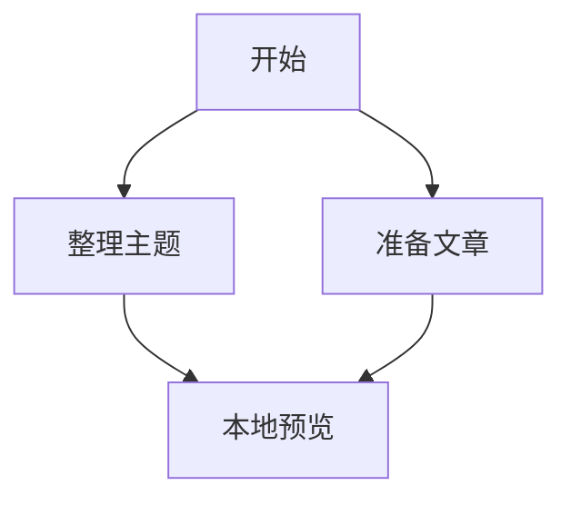
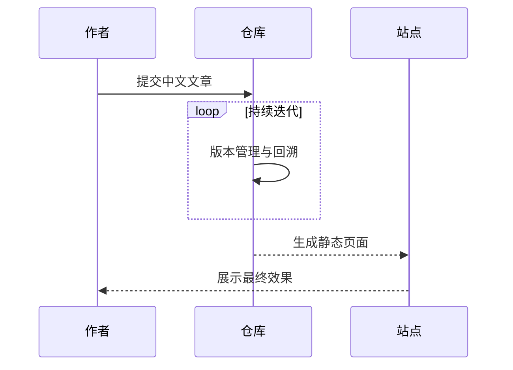

这个主题支持 [mermaid.js](https://mermaid.js.org/)，可以直接在 Markdown 里写流程图、时序图等可视化内容。

只要在文章头信息里设置 `mermaid: true`，页面就会自动加载图表能力。

```markdown
---
title: Mermaid 图表示例
date: 2023-08-31
layout: post
mermaid: true
---
```

然后就可以直接写 Mermaid 语法：

```
graph TD;
    开始-->整理主题;
    开始-->准备文章;
    整理主题-->本地预览;
    准备文章-->本地预览;
```



也可以写更复杂一点的时序图：

```
sequenceDiagram
    participant 作者
    participant 仓库
    participant 站点
    作者->>仓库: 提交中文文章
    loop 持续迭代
        仓库->>仓库: 版本管理与回溯
    end
    仓库-->>站点: 生成静态页面
    站点-->>作者: 展示最终效果
```



如果后面你想做流程说明、架构关系图或发布流程图，这个功能会很好用。
